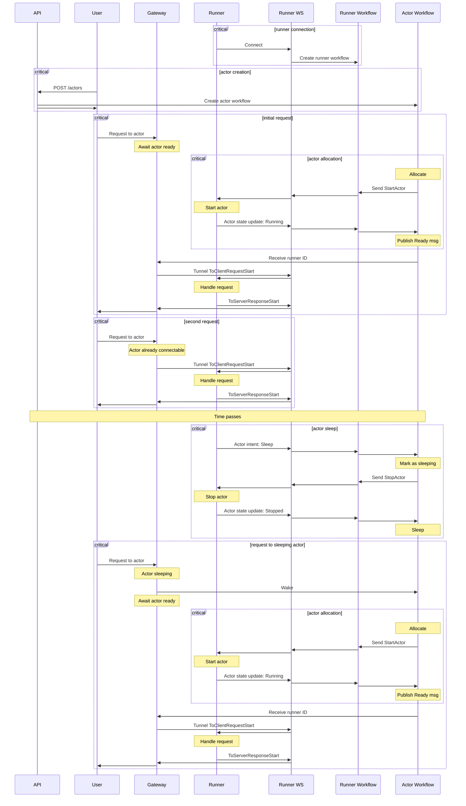

# Actor Lifecycle Flow Diagram

```mermaid
---
config:
  theme: mc
  look: classic
---
sequenceDiagram
  participant A as API
  participant U as User
  participant G as Gateway

  participant R as Runner
  participant RWS as Runner WS
  participant RWF as Runner Workflow
  participant AWF as Actor Workflow

  critical runner connection
    R->>RWS: Connect
    RWS->>RWF: Create runner workflow
  end

  critical actor creation
    U->>A: POST /actors

    A->>AWF: Create actor workflow
    A->>U:
  end

  critical initial request
    U->>G: Request to actor
    note over G: Await actor ready
    
    critical actor allocation
      note over AWF: Allocate
    
      AWF->>RWF: Send StartActor

      RWF->>RWS:
      RWS->>R:
      note over R: Start actor
      R->>RWS: Actor state update: Running
      RWS->>RWF:
      RWF->>AWF:
      note over AWF: Publish Ready msg
    end
    AWF->>G: Receive runner ID

    G->>RWS: Tunnel ToClientRequestStart
    RWS->>R:
    note over R: Handle request
    R->>RWS: ToServerResponseStart
    RWS->>G:
    G->>U:
  end

  critical second request
    U->>G: Request to actor
    note over G: Actor already connectable
    G->>RWS: Tunnel ToClientRequestStart
    RWS->>R:
    note over R: Handle request
    R->>RWS: ToServerResponseStart
    RWS->>G:
    G->>U:
  end

  note over A, AWF: Time passes

  critical actor sleep
    R->>RWS: Actor intent: Sleep
    RWS->>RWF:
    RWF->>AWF:
    note over AWF: Mark as sleeping
    AWF->>RWF: Send StopActor
    RWF->>RWS:
    RWS->>R:
    note over R: Stop actor
    R->>RWS: Actor state update: Stopped
    RWS->>RWF:
    RWF->>AWF:
    note over AWF: Sleep
  end
  
  critical request to sleeping actor
    U->>G: Request to actor
    note over G: Actor sleeping
    G->>AWF: Wake
    note over G: Await actor ready
    critical actor allocation
      note over AWF: Allocate
      AWF->>RWF: Send StartActor
      RWF->>RWS:
      RWS->>R:
      note over R: Start actor
      R->>RWS: Actor state update: Running
      RWS->>RWF:
      RWF->>AWF:
      note over AWF: Publish Ready msg
    end
    AWF->>G: Receive runner ID

    G->>RWS: Tunnel ToClientRequestStart
    RWS->>R:
    note over R: Handle request
    R->>RWS: ToServerResponseStart
    RWS->>G:
    G->>U:
  end
```