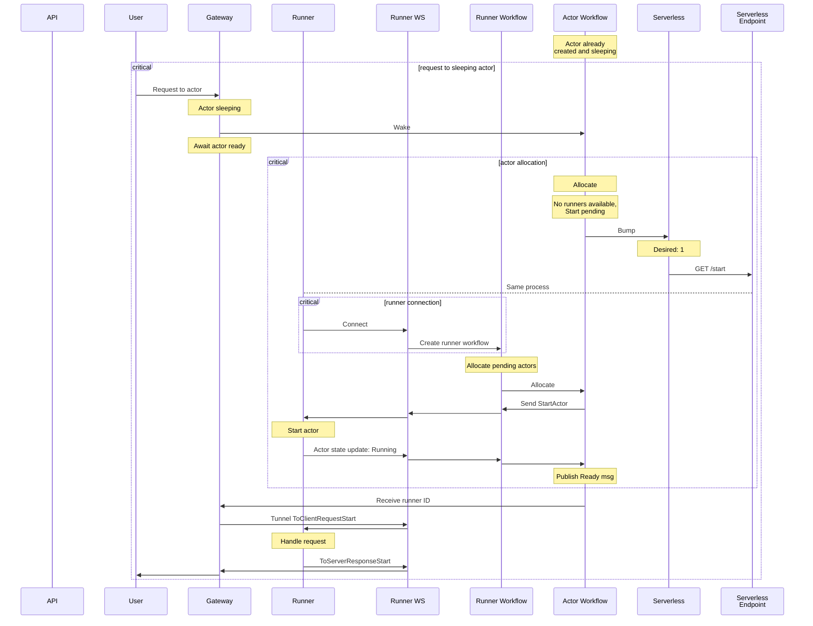

# Serverless Flow Diagrams

## Ideal Serverless Flow

```mermaid
---
config:
  theme: mc
  look: classic
---
sequenceDiagram
  participant A as API
  participant U as User
  participant G as Gateway

  participant R as Runner
  participant RWS as Runner WS
  participant RWF as Runner Workflow
  participant AWF as Actor Workflow
  participant S as Serverless
  participant SE as Serverless<br/>Endpoint

  note over AWF: Actor already<br/>created and sleeping

  critical request to sleeping actor
    U->>G: Request to actor
    note over G: Actor sleeping
    G->>AWF: Wake
    note over G: Await actor ready
    
    critical actor allocation
      note over AWF: Allocate

      note over AWF: No runners available,<br/>Start pending
      AWF->>S: Bump
      note over S: Desired: 1
      S->>SE: GET /start
      SE-->R: Same process

      critical runner connection
        R->>RWS: Connect
        RWS->>RWF: Create runner workflow
      end

      note over RWF: Allocate pending actors
      RWF->>AWF: Allocate
    
      AWF->>RWF: Send StartActor

      RWF->>RWS:
      RWS->>R:
      note over R: Start actor
      R->>RWS: Actor state update: Running
      RWS->>RWF:
      RWF->>AWF:
      note over AWF: Publish Ready msg
    end
    AWF->>G: Receive runner ID

    G->>RWS: Tunnel ToClientRequestStart
    RWS->>R:
    note over R: Handle request
    R->>RWS: ToServerResponseStart
    RWS->>G:
    G->>U:
  end

%%   note over A, AWF: Time passes

%%   critical actor sleep
%%     R->>RWS: Actor intent: Sleep
%%     RWS->>RWF:
%%     RWF->>AWF:
%%     note over AWF: Mark as sleeping
%%     AWF->>RWF: Send StopActor
%%     RWF->>RWS:
%%     RWS->>R:
%%     note over R: Stop actor
%%     R->>RWS: Actor state update: Stopped
%%     RWS->>RWF:
%%     RWF->>AWF:
%%     note over AWF: Sleep
%%   end
```

## Messy Serverless Flow

```mermaid
---
config:
  theme: mc
  look: classic
---
sequenceDiagram
  %% participant A as API
  participant U as User
  participant G as Gateway

  participant R as Runner
  participant RWS as Runner WS
  participant RWF as Runner Workflow
  participant AWF as Actor Workflow
  participant S as Serverless
  participant SE as Serverless<br/>Endpoint

  note over R, RWF: For simplicity, this represents multiple<br/>runners/runner workflows
  note over AWF: Actor already<br/>created and sleeping

  critical request to sleeping actor
    U->>G: GET /sleep<br/>(actor endpoint)
    note over G: Actor sleeping
    G->>AWF: Wake
    note over G: Await actor ready
    
    critical actor allocation
      note over AWF: Allocate
      note over AWF: No runners available,<br/>Start pending
      AWF->>S: Bump
      note over S: Desired: 1
      S->>SE: GET /start
      SE-->R: Same process

      critical runner connection
        R->>RWS: Connect
        RWS->>RWF: Create runner workflow
      end

      note over RWF: Allocate pending actors
      RWF->>AWF: Allocate
    
      AWF->>RWF: Send StartActor

      RWF->>RWS:
      RWS->>R:
      note over R: Start actor
      R->>RWS: Actor state update: Running
      RWS->>RWF:
      RWF->>AWF:
      note over AWF: Publish Ready msg
    end
    AWF->>G: Receive runner ID

    G->>RWS: Tunnel ToClientRequestStart
    RWS->>R:
    note over R: Handle GET /sleep
    R->>RWS: Actor intent: Sleep
    RWS->>RWF:
    R->>RWS: ToServerResponseStart
    RWS->>G:
    G->>U:
  end

  note over U: Immediately request<br/>sleep endpoint again

  critical request to running actor
    U->>G: GET /sleep<br/>(actor endpoint)
    note over G: Actor running
    G->>RWS: Tunnel ToClientRequestStart
    RWS->>R:
    note over R: Handle GET /sleep
    R->>RWS: Actor intent: Sleep
    RWS->>RWF:
    R->>RWS: ToServerResponseStart
    RWS->>G:
    G->>U:
  end

  critical actor sleep
    RWF->>AWF: Actor intent: Sleep
    note over AWF: Mark as sleeping
    AWF->>RWF: Send StopActor
    RWF->>AWF: Second actor intent: Sleep
    note over AWF: Ignored, already<br/>marked as sleeping
  end

  critical request to actor marked as sleeping
    U->>G: GET /sleep<br/>(actor endpoint)
    note over G: Actor sleeping
    G->>AWF: Wake
    note over G: Await actor ready
    note over AWF: Actor is currently marked<br/>as sleeping but has not stopped<br/>yet, defer wake after stop
    critical actor sleep cont
      RWF->>RWS: Proxy StopActor<br/>(from before)
      RWS->>R:
      note over R: Stop actor
      R->>RWS: Actor state update: Stopped
      RWS->>RWF:
      RWF->>AWF:
      note over AWF: Deallocate
      AWF->>S: Bump
      note over AWF: Send Stopped msg
    end
    AWF->>G: Receive Stopped msg
    G->>AWF: Retry wake
    critical actor reallocation
      note over AWF: Deferred wake
      note over AWF: Allocate
      AWF->>RWF: Send StartActor
      RWF->>RWS:
      RWS->>R:
      note over R: Start actor
      R->>RWS: Actor state update: Running
      note over AWF: Ignore retry wake (from before)<br/>because we are already allocated
    
      S->>RWF: Stop
      note over S: After grace
      S->>RWS: Evict WS
      RWS->>R:
      note over RWF: Remove from alloc idx
      note over RWF: Evict running actors
      RWF->>AWF: Actor lost
      note over AWF: Deallocate
      note over AWF: Send Stopped msg
      AWF->>G: Receive Stopped msg
      G->>AWF: Retry wake
      note over AWF: Allocate
      note over AWF: No runners available,<br/>Start pending
      AWF->>S: Bump
      note over S: Desired: 1
      S->>SE: GET /start
      note over R, SE: Second runner
      SE-->R: Same process

      critical runner connection
        R->>RWS: Connect
        RWS->>RWF: Create runner workflow
      end

      note over RWF: Allocate pending actors
      RWF->>AWF: Allocate
        
      AWF->>RWF: Send StartActor

      RWF->>RWS:
      RWS->>R:
      note over R: Start actor
      R->>RWS: Actor state update: Running
      RWS->>RWF:
      RWF->>AWF:
      note over AWF: Publish Ready msg
    end
    AWF->>G: Receive runner ID
    G->>RWS: Tunnel ToClientRequestStart
    RWS->>R:
    note over R: Handle GET /sleep
    R->>RWS: Actor intent: Sleep
    RWS->>RWF:
    R->>RWS: ToServerResponseStart
    RWS->>G:
    G->>U:
  end

  critical actor sleep
    RWF->>AWF: Actor intent: Sleep
    note over AWF: Mark as sleeping
    AWF->>RWF: Send StopActor
    RWF->>RWS:
    RWS->>R:
    note over R: Stop actor
    R->>RWS: Actor state update: Stopped
    RWS->>RWF:
    RWF->>AWF:
    note over AWF: Deallocate
    AWF->>S: Bump
    note over AWF: Send Stopped msg
  end

  S->>RWF: Stop
  note over RWF: Remove from alloc idx
  note over S: After grace
  S->>RWS: Evict WS
  RWS->>R:
```