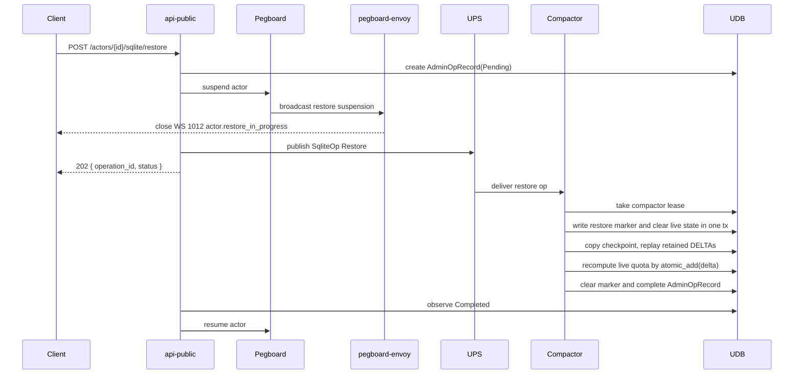
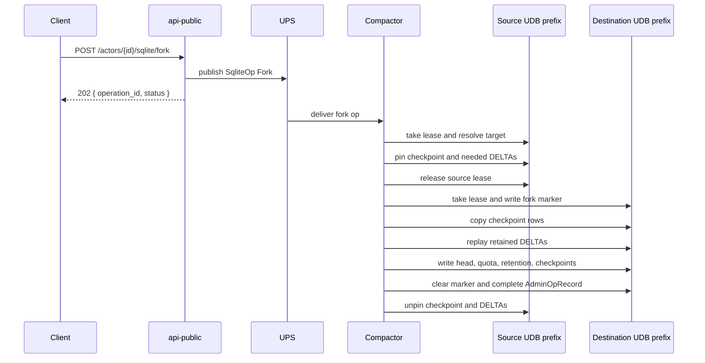
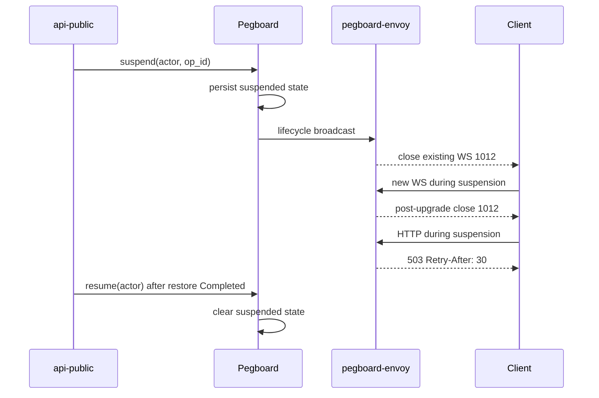

# SQLite PITR + Forking

PITR and fork operations sit on top of stateless SQLite storage. The actor hot path still owns only `get_pages` and `commit`; long-running recovery work runs through api-public, persisted admin records, UPS, and the standalone compactor.

**PITR is logical recovery only. It is NOT a backup against FoundationDB cluster loss. Object-store tiering is the eventual DR story.**

## Storage Model

Each actor keeps live SQLite state under the existing actor prefix and adds PITR metadata beside it:

| Key | Purpose |
|---|---|
| `/META/storage_used_live` | Fixed-width little-endian `i64` counter for live SQLite bytes. |
| `/META/storage_used_pitr` | Fixed-width little-endian `i64` counter for checkpoints and retained DELTAs. |
| `/META/retention` | vbare `RetentionConfig`. Defaults disable PITR. |
| `/META/checkpoints` | vbare checkpoint index used by retention views and cleanup. |
| `/CHECKPOINT/{T}/META` | Checkpoint metadata and refcount for txid `T`. |
| `/CHECKPOINT/{T}/SHARD/*` | Frozen compacted pages for checkpoint `T`. |
| `/CHECKPOINT/{T}/PIDX/delta/*` | Frozen PIDX rows that still point at retained DELTAs. |
| `/DELTA/{T}/META` | DELTA timestamp, byte count, and refcount. |
| `/META/admin_op/{operation_id}` | Persisted `AdminOpRecord`; this is the admin op source of truth. |
| `/META/restore_in_progress` | Restore marker and resume point. Commits reject while present. |
| `/META/fork_in_progress` | Destination-side fork marker and resume point. |

The old single `/META/quota` is migrated into `/META/storage_used_live`; PITR overhead is tracked separately in `/META/storage_used_pitr`.

## Checkpoints

The compactor creates checkpoints during normal compact passes when retention is enabled and the configured interval is due. The checkpoint txid is captured from `/META/head` during the plan phase and reused for every checkpoint row. A later commit must not change the point the checkpoint claims to represent.

Checkpoint creation copies SHARD and PIDX rows in bounded transactions, then publishes visibility in a final transaction by writing `/CHECKPOINT/{T}/META`, updating `/META/checkpoints`, and adding to `/META/storage_used_pitr`.

Retention-aware cleanup may delete a DELTA only when:

1. It is covered by the latest checkpoint.
2. Its `taken_at_ms` is outside the retention window.
3. Its refcount is zero.

If `retention_ms == 0`, cleanup collapses back to base compaction behavior.

## Restore Flow

The first destructive restore transaction writes `/META/restore_in_progress` and clears live SHARD/PIDX state together. This prevents a commit from observing cleared storage without also observing the restore marker.

Commits read the restore marker on first use for an `ActorDb` and cache the observed-clear result. If the marker exists, commit returns `sqlite_admin.actor_restore_in_progress`.

## Fork Flow

Fork destinations must be self-contained. If a checkpoint PIDX row references a source DELTA, the fork copies the referenced DELTA into the destination actor so destination PIDX never points at source-only data.

## Refcount Lifecycle

Forks pin both the selected checkpoint and every DELTA in `(checkpoint_txid, target_txid]`.

Refcount ordering is deliberately strict:

1. Increment every required refcount in a committed transaction.
2. Release the source compactor lease in a later committed transaction.
3. Copy and replay data.
4. Decrement refcounts in a separate committed transaction after all work is done.

Cleanup follows the same separation on failure. The compactor also scans for leaked refcounts. If a nonzero refcount has no live admin operation for `lease_ttl_ms * 10`, it records the leak and resets the refcount to zero.

## Marker Recovery

`/META/restore_in_progress` and `/META/fork_in_progress` are resume cursors, not just locks. Each marker records the target txid, checkpoint txid, holder, operation id, and last completed step.

When a compactor pod dies:

1. Another pod takes the compactor lease.
2. It reads the marker and persisted `AdminOpRecord`.
3. It resumes at the recorded step.
4. Every step is idempotent, so re-copying pages or re-writing the final head is safe.

Admin operation state stays in `/META/admin_op/{operation_id}`. UPS is only the wakeup signal.

## Suspend And Resume

Restore is destructive, so api-public suspends the actor before publishing the restore operation. Pegboard persists the suspension gate and broadcasts it to envoys as a fast path.

If restore fails, api-public leaves the actor suspended for operator action.

## Operational Notes

- PITR is disabled by default at the namespace level.
- Namespace config gates PITR read, destructive restore, admin operations, and fork independently.
- Apply restore is destructive; DryRun reports the checkpoint and DELTAs that would be used.
- Live data is still capped separately from PITR overhead.
- PITR budgets should be sized from retained DELTA rate plus checkpoint size.
- `1012 actor.restore_in_progress` is expected during restore. Clients should reconnect after backoff.

## Related Code

- `engine/packages/sqlite-storage/src/pump/keys.rs`
- `engine/packages/sqlite-storage/src/compactor/restore.rs`
- `engine/packages/sqlite-storage/src/compactor/fork.rs`
- `engine/packages/sqlite-storage/src/admin/record.rs`
- `engine/packages/api-public/src/actors/sqlite_admin.rs`
- `engine/packages/pegboard-envoy/src/restore_lifecycle.rs`
