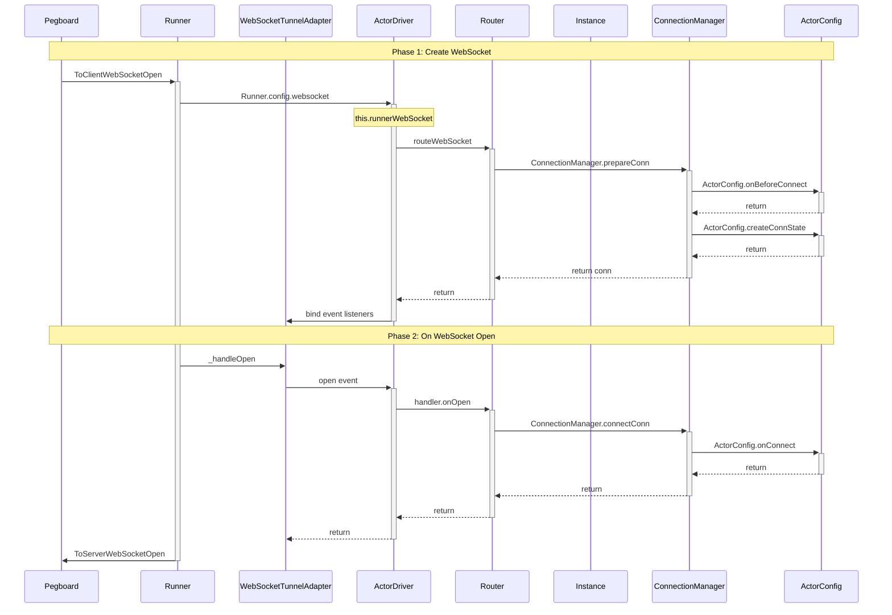
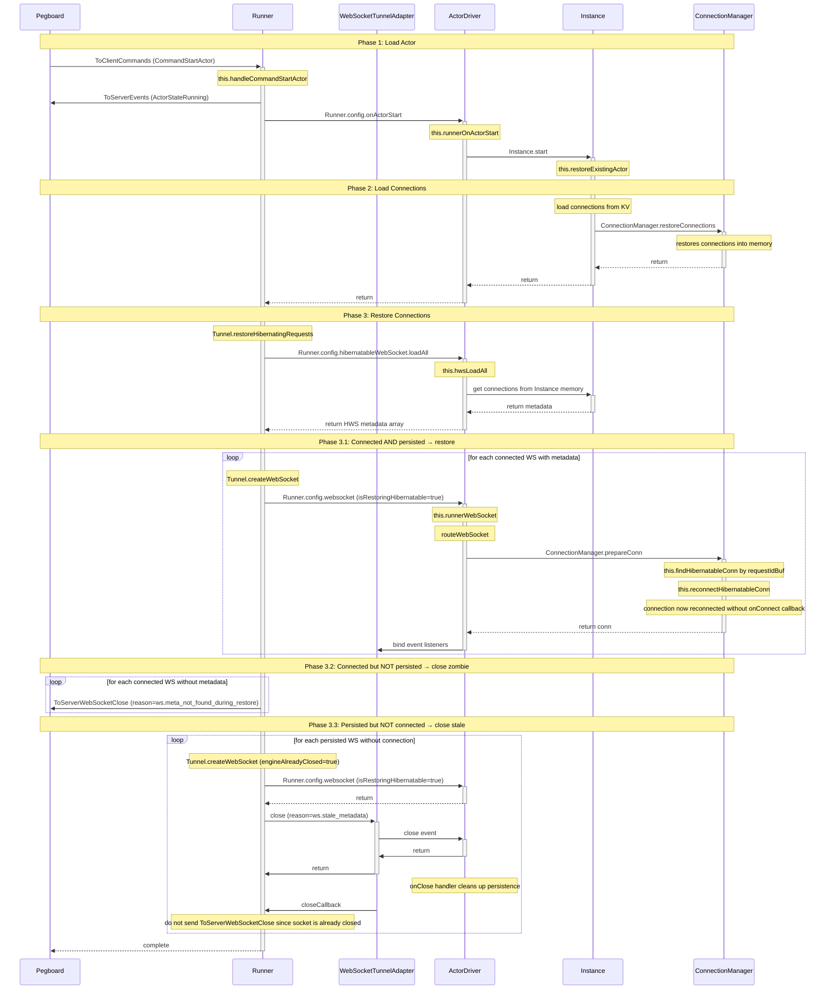
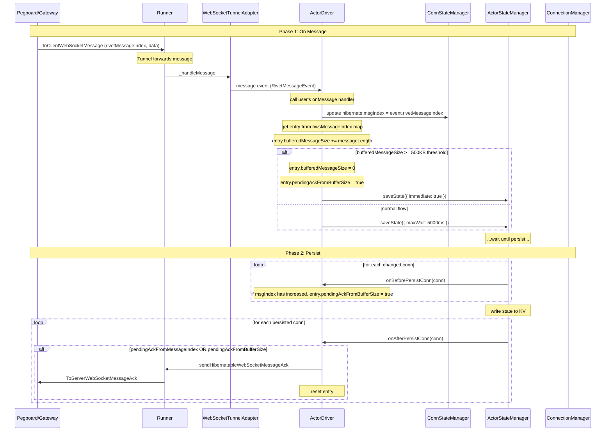
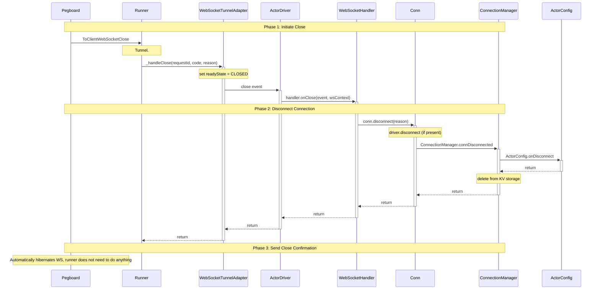

# Hibernatable Connections

## Lifecycle

### New Connection

```mermaid
sequenceDiagram
	participant P as Pegboard
	participant R as Runner
	participant WS as WebSocketTunnelAdapter
	participant AD as ActorDriver
	participant RT as Router
	participant I as Instance
	participant CM as ConnectionManager
	participant AC as ActorConfig

	note over P,AC: Phase 1: Create WebSocket

	P->>+R: ToClientWebSocketOpen
	R->>+AD: Runner.config.websocket
	note over AD: this.runnerWebSocket
	AD->>+RT: routeWebSocket
	RT->>+CM: ConnectionManager.prepareConn
	CM->>+AC: ActorConfig.onBeforeConnect
	AC-->>-CM: return
	CM->>+AC: ActorConfig.createConnState
	AC-->>-CM: return
	CM-->>-RT: return conn
	RT-->>-AD: return
	AD->>-WS: bind event listeners

	note over P,AC: Phase 2: On WebSocket Open

	R->>WS: _handleOpen
	WS->>+AD: open event
	AD->>+RT: handler.onOpen
	RT->>+CM: ConnectionManager.connectConn
	CM->>+AC: ActorConfig.onConnect
	AC-->>-CM: return
	CM-->>-RT: return
	RT-->>-AD: return
	AD-->>-WS: return
	R->>-P: ToServerWebSocketOpen
```

### Restore Connection

```mermaid
sequenceDiagram
	participant P as Pegboard
	participant R as Runner
	participant WS as WebSocketTunnelAdapter
	participant AD as ActorDriver
	participant I as Instance
	participant CM as ConnectionManager

	note over P,CM: Phase 1: Load Actor

	P->>+R: ToClientCommands (CommandStartActor)
	note over R: this.handleCommandStartActor
	R->>P: ToServerEvents (ActorStateRunning)

	R->>+AD: Runner.config.onActorStart
	note over AD: this.runnerOnActorStart
	AD->>+I: Instance.start

	note over I: this.restoreExistingActor

	note over P,CM: Phase 2: Load Connections

	note over I: load connections from KV
	I->>+CM: ConnectionManager.restoreConnections
	note over CM: restores connections into memory
	CM-->>-I: return
	I-->>-AD: return
	AD-->>-R: return

	note over P,CM: Phase 3: Restore Connections

	note over R: Tunnel.restoreHibernatingRequests
	R->>+AD: Runner.config.hibernatableWebSocket.loadAll
	note over AD: this.hwsLoadAll
	AD->>+I: get connections from Instance memory
	I-->>-AD: return metadata
	AD-->>-R: return HWS metadata array

	note over P,CM: Phase 3.1: Connected AND persisted → restore
	loop for each connected WS with metadata
		note over R: Tunnel.createWebSocket
		R->>+AD: Runner.config.websocket (isRestoringHibernatable=true)
		note over AD: this.runnerWebSocket
		note over AD: routeWebSocket
		AD->>+CM: ConnectionManager.prepareConn
		note over CM: this.findHibernatableConn by requestIdBuf
		note over CM: this.reconnectHibernatableConn
		note over CM: connection now reconnected without onConnect callback
		CM-->>-AD: return conn
		AD->>-WS: bind event listeners
	end

	note over P,CM: Phase 3.2: Connected but NOT persisted → close zombie
	loop for each connected WS without metadata
		R->>P: ToServerWebSocketClose (reason=ws.meta_not_found_during_restore)
	end

	note over P,CM: Phase 3.3: Persisted but NOT connected → close stale
	loop for each persisted WS without connection
		note over R: Tunnel.createWebSocket (engineAlreadyClosed=true)
		R->>+AD: Runner.config.websocket (isRestoringHibernatable=true)
		AD-->>-R: return
		R->>+WS: close (reason=ws.stale_metadata)
		WS->>+AD: close event
		AD->>-WS: return
		WS->>-R: return
		note over AD: onClose handler cleans up persistence
		WS->>R: closeCallback
		note over R: do not send ToServerWebSocketClose since socket is already closed
	end
	R-->>-P: complete
```

### Persisting Message Index

```mermaid
sequenceDiagram
	participant P as Pegboard/Gateway
	participant R as Runner
	participant WS as WebSocketTunnelAdapter
	participant AD as ActorDriver
	participant CSM as ConnStateManager
	participant ASM as ActorStateManager
	participant CM as ConnectionManager

    note over P,CM: Phase 1: On Message

	P->>R: ToClientWebSocketMessage (rivetMessageIndex, data)
	note over R: Tunnel forwards message
	R->>WS: _handleMessage
	WS->>AD: message event (RivetMessageEvent)

	note over AD: call user's onMessage handler
	AD->>CSM: update hibernate.msgIndex = event.rivetMessageIndex
	note over AD: get entry from hwsMessageIndex map
	note over AD: entry.bufferedMessageSize += messageLength

	alt bufferedMessageSize >= 500KB threshold
		note over AD: entry.bufferedMessageSize = 0
		note over AD: entry.pendingAckFromBufferSize = true
		AD->>ASM: saveState({ immediate: true })
	else normal flow
		AD->>ASM: saveState({ maxWait: 5000ms })
	end

    note over ASM: ...wait until persist...

    note over P,CM: Phase 2: Persist

	loop for each changed conn
		ASM->>AD: onBeforePersistConn(conn)
		note over AD: if msgIndex has increased, entry.pendingAckFromBufferSize = true
	end

    note over ASM: write state to KV

	loop for each persisted conn
		ASM->>AD: onAfterPersistConn(conn)
		alt pendingAckFromMessageIndex OR pendingAckFromBufferSize
			AD->>R: sendHibernatableWebSocketMessageAck
			R->>P: ToServerWebSocketMessageAck
			note over AD: reset entry
		end
	end
```

### Close Connection

```mermaid
sequenceDiagram
	participant P as Pegboard
	participant R as Runner
	participant WS as WebSocketTunnelAdapter
	participant AD as ActorDriver
	participant H as WebSocketHandler
	participant C as Conn
	participant CM as ConnectionManager
	participant AC as ActorConfig

	note over P,CM: Phase 1: Initiate Close

	P->>R: ToClientWebSocketClose
	note over R: Tunnel.#handleWebSocketClose
	R->>+WS: _handleClose(requestId, code, reason)

	note over WS: set readyState = CLOSED
	WS->>+AD: close event
	AD->>+H: handler.onClose(event, wsContext)

	note over P,CM: Phase 2: Disconnect Connection

	H->>+C: conn.disconnect(reason)
	note over C: driver.disconnect (if present)
	C->>+CM: ConnectionManager.connDisconnected
	CM->>+AC: ActorConfig.onDisconnect
	AC-->>-CM: return
	note over CM: delete from KV storage
	CM-->>-C: return
	C-->>-H: return
	H-->>-AD: return
	AD-->>-WS: return
	WS-->>-R: return

	note over P,CM: Phase 3: Send Close Confirmation

	note over P: Automatically hibernates WS, runner does not need to do anything
```

