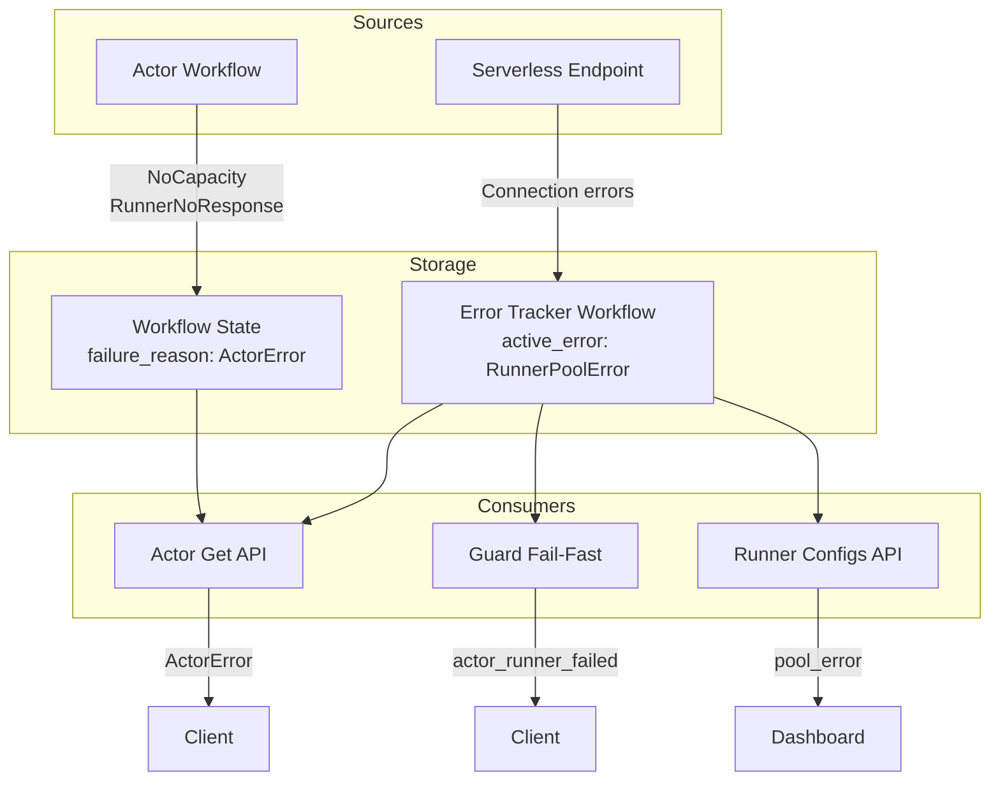

# Actor Errors

## Overview

Actor errors come from two sources:

1. **Direct actor errors** - From the actor workflow itself (stored in workflow state as `ActorError`)
2. **Runner pool errors** - From serverless endpoints, tracked by the runner pool error tracker workflow

Errors use a two-layer representation:

- `ActorError` - Internal enum stored in workflow state (`NoCapacity`, `RunnerNoResponse`)
- `ActorError` - API-facing enum with enriched context (`PoolError`, `NoCapacity`, `RunnerNoResponse`)

The **runner pool error tracker** monitors serverless endpoint health. When errors occur, it stores them with timestamps. Errors are cleared after 3 consecutive successes (hysteresis).

## Error Sources

### Direct Actor Errors

Stored in actor workflow state as `failure_reason`:

- **NoCapacity** - No runner available to allocate the actor
- **RunnerNoResponse** - Runner was allocated but became unresponsive (includes `runner_id`)

Set when:
- Runner allocation fails or times out
- Runner disconnects while actor was allocated

### Runner Pool Errors

Tracked separately by `runner_pool_error_tracker` workflow for serverless configs:

- **RunnerPoolError** - Contains error details from failed endpoint requests. Variants include:
  - `ServerlessHttpError` - HTTP error (status code, body)
  - `ServerlessStreamEndedEarly` - SSE stream ended before runner initialized
  - `ServerlessConnectionError` - Network/connection error
  - `ServerlessInvalidBase64` - Invalid base64 in SSE message
  - `ServerlessInvalidPayload` - Invalid protocol payload
  - `InternalError` - Internal errors (namespace not found, config not found, etc.)

The error tracker:
- Receives errors from the serverless pool manager
- Stores `active_error` with timestamp
- Clears error after 3 consecutive successful runner startups
- Makes state queryable for API enrichment and guard fail-fast

## Error Consumption

### API Response Enrichment

When fetching actors via the API (`pegboard::ops::actor::get`):

1. Check if actor has `failure_reason: NoCapacity`
2. Query the error tracker workflow for the actor's runner config
3. If pool has active error, return `PoolError` with details
4. Otherwise return plain `NoCapacity`

This provides users with actionable error info (e.g., "serverless endpoint returned 500") instead of generic "no capacity".

### Guard Fail-Fast

When guard is waiting for an actor to become ready:

1. Wait 1 second before starting checks (allow normal startup)
2. Every 2 seconds, poll the error tracker workflow
3. If active error exists, return `actor_runner_failed` immediately

This prevents clients from waiting the full ready timeout when the runner pool is known to be failing.

### Runner Configs API

The runner configs list endpoint enriches serverless configs with current pool errors:

1. For each serverless config, find its error tracker workflow
2. If active error exists, populate `pool_error` field
3. Allows dashboards to show pool health status

## Error Flow Diagram

