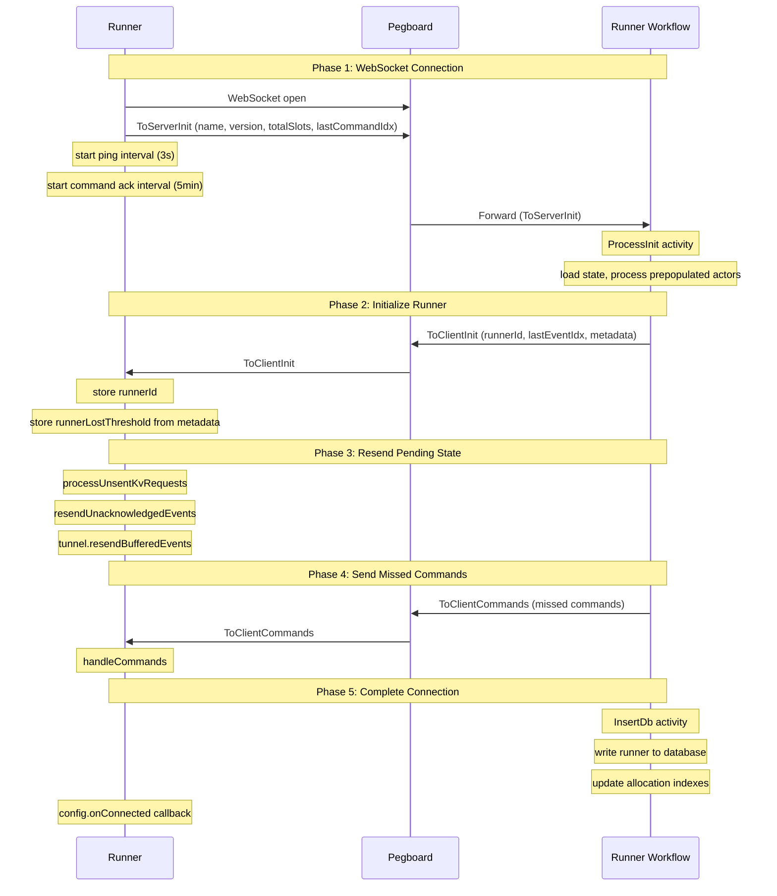
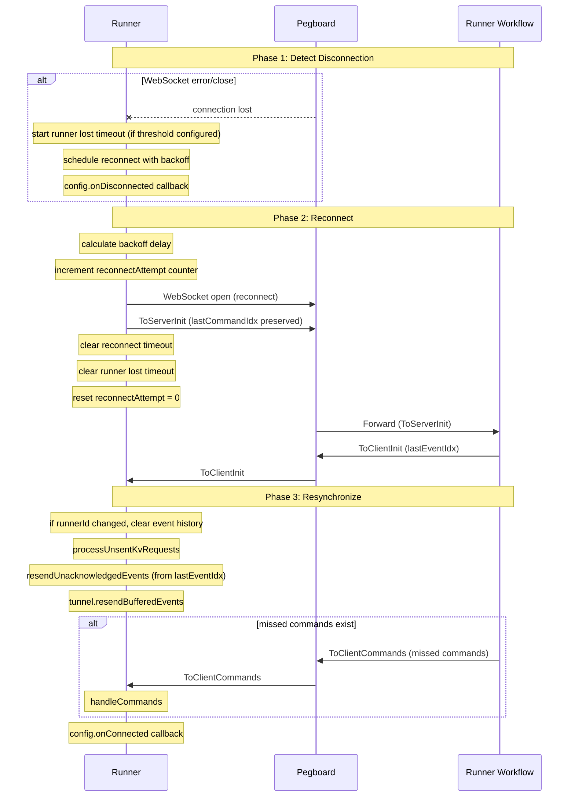
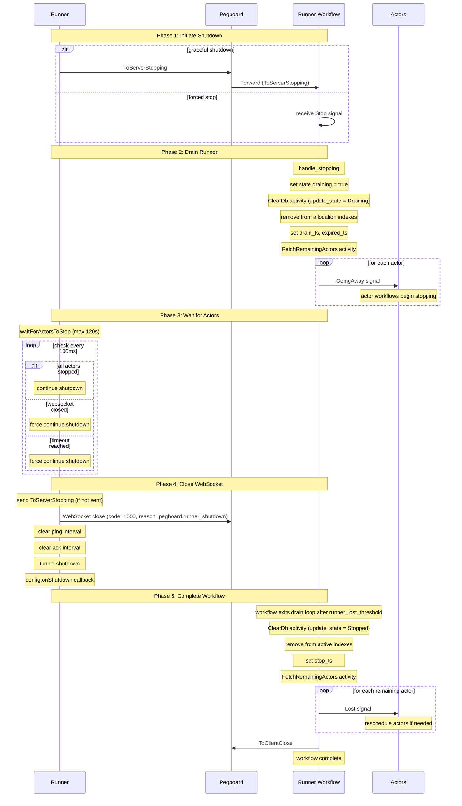

# Runner Lifecycle

## Connection

```mermaid
sequenceDiagram
	participant R as Runner
	participant P as Pegboard
	participant RW as Runner Workflow

	note over R,RW: Phase 1: WebSocket Connection

	R->>P: WebSocket open
	R->>P: ToServerInit (name, version, totalSlots, lastCommandIdx)
	note over R: start ping interval (3s)
	note over R: start command ack interval (5min)

	P->>RW: Forward (ToServerInit)
	note over RW: ProcessInit activity
	note over RW: load state, process prepopulated actors

	note over R,RW: Phase 2: Initialize Runner

	RW->>P: ToClientInit (runnerId, lastEventIdx, metadata)
	P->>R: ToClientInit

	note over R: store runnerId
	note over R: store runnerLostThreshold from metadata

	note over R,RW: Phase 3: Resend Pending State

	note over R: processUnsentKvRequests
	note over R: resendUnacknowledgedEvents
	note over R: tunnel.resendBufferedEvents

	note over R,RW: Phase 4: Send Missed Commands

	RW->>P: ToClientCommands (missed commands)
	P->>R: ToClientCommands
	note over R: handleCommands

	note over R,RW: Phase 5: Complete Connection

	note over RW: InsertDb activity
	note over RW: write runner to database
	note over RW: update allocation indexes

	note over R: config.onConnected callback
```

## Reconnect

```mermaid
sequenceDiagram
	participant R as Runner
	participant P as Pegboard
	participant RW as Runner Workflow

	note over R,RW: Phase 1: Detect Disconnection

	alt WebSocket error/close
		P--xR: connection lost
		note over R: start runner lost timeout (if threshold configured)
		note over R: schedule reconnect with backoff
		note over R: config.onDisconnected callback
	end

	note over R,RW: Phase 2: Reconnect

	note over R: calculate backoff delay
	note over R: increment reconnectAttempt counter

	R->>P: WebSocket open (reconnect)
	R->>P: ToServerInit (lastCommandIdx preserved)

	note over R: clear reconnect timeout
	note over R: clear runner lost timeout
	note over R: reset reconnectAttempt = 0

	P->>RW: Forward (ToServerInit)
	RW->>P: ToClientInit (lastEventIdx)
	P->>R: ToClientInit

	note over R,RW: Phase 3: Resynchronize

	note over R: if runnerId changed, clear event history

	note over R: processUnsentKvRequests
	note over R: resendUnacknowledgedEvents (from lastEventIdx)
	note over R: tunnel.resendBufferedEvents

	alt missed commands exist
		RW->>P: ToClientCommands (missed commands)
		P->>R: ToClientCommands
		note over R: handleCommands
	end

	note over R: config.onConnected callback
```

## Shutdown

```mermaid
sequenceDiagram
	participant R as Runner
	participant P as Pegboard
	participant RW as Runner Workflow
	participant A as Actors

	note over R,RW: Phase 1: Initiate Shutdown

	alt graceful shutdown
		R->>P: ToServerStopping
		P->>RW: Forward (ToServerStopping)
	else forced stop
		RW->>RW: receive Stop signal
	end

	note over R,RW: Phase 2: Drain Runner

	note over RW: handle_stopping
	note over RW: set state.draining = true
	note over RW: ClearDb activity (update_state = Draining)
	note over RW: remove from allocation indexes
	note over RW: set drain_ts, expired_ts

	note over RW: FetchRemainingActors activity
	loop for each actor
		RW->>A: GoingAway signal
		note over A: actor workflows begin stopping
	end

	note over R,RW: Phase 3: Wait for Actors

	note over R: waitForActorsToStop (max 120s)
	loop check every 100ms
		alt all actors stopped
			note over R: continue shutdown
		else websocket closed
			note over R: force continue shutdown
		else timeout reached
			note over R: force continue shutdown
		end
	end

	note over R,RW: Phase 4: Close WebSocket

	note over R: send ToServerStopping (if not sent)
	R->>P: WebSocket close (code=1000, reason=pegboard.runner_shutdown)
	note over R: clear ping interval
	note over R: clear ack interval
	note over R: tunnel.shutdown

	note over R: config.onShutdown callback

	note over R,RW: Phase 5: Complete Workflow

	note over RW: workflow exits drain loop after runner_lost_threshold

	note over RW: ClearDb activity (update_state = Stopped)
	note over RW: remove from active indexes
	note over RW: set stop_ts

	note over RW: FetchRemainingActors activity
	loop for each remaining actor
		RW->>A: Lost signal
		note over A: reschedule actors if needed
	end

	RW->>P: ToClientClose
	note over RW: workflow complete
```
