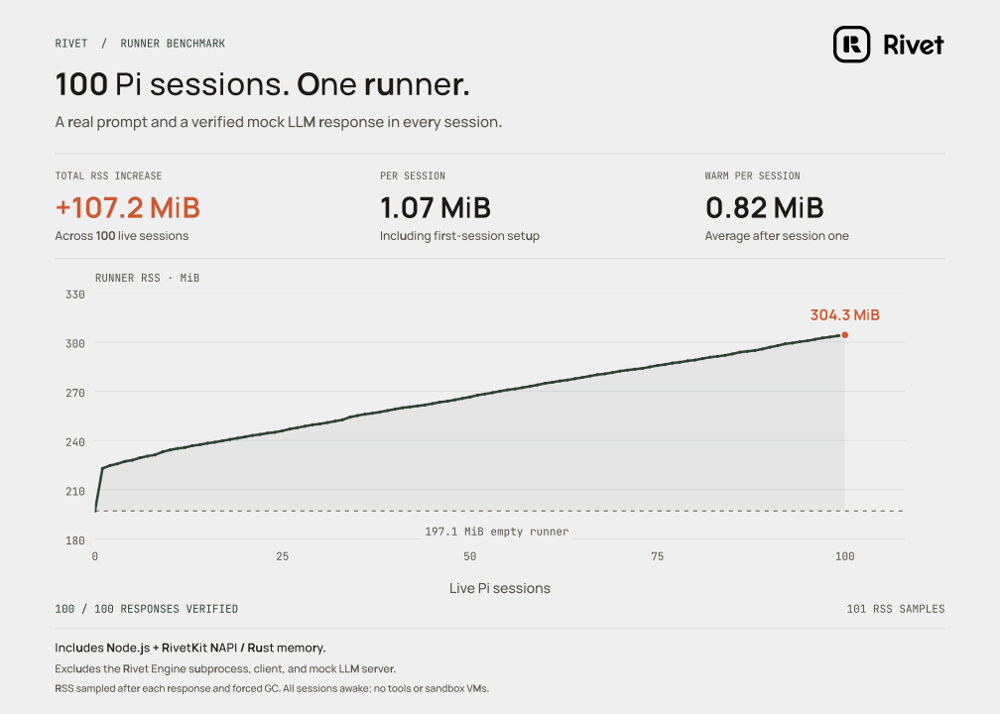

# Pi session memory benchmark

Measure the incremental resident memory of Pi sessions on a single RivetKit runner. Each session sends a distinct prompt to a local mock LLM HTTP endpoint and retains a verified assistant response. All sessions stay awake.

RSS is read **inside the Node.js runner**, so it includes RivetKit's native NAPI/Rust and SQLite allocations. The Rivet Engine subprocess, client, and mock LLM server are excluded. Samples are taken at baseline and after every completed response, before and after three explicit garbage collections. This measures retained resident memory, not peak memory during generation. No tools or sandbox VMs are used.

## Run

Requires Linux, Node.js 22.19+, pnpm, and a compatible native RivetKit build and Engine binary. From the repository root:

```sh
pnpm install
pnpm exec turbo build --filter=@rivet-dev/pi
node integrations/pi/benchmarks/session-memory/bench.mjs --output /tmp/pi-memory-run
```

The output directory must not already exist. Omit `--output` to create a unique temporary directory. Use `--sessions 5` for a short smoke run; the default is 100. RivetKit resolves the Engine binary normally; `RIVET_ENGINE_BINARY=/absolute/path/to/rivet-engine` can select a local build.

The harness uses a fresh storage directory and a separate process group for the runner and its Engine. It shuts down that group after the run. The mock provider uses dummy credentials in the output directory and does not require a real model API key.

`results.json` contains every RSS sample, pre-GC RSS, heap usage, private resident bytes, elapsed time, and response validation counts. `samples.json` checkpoints progress after each session; `runner.log` records runner diagnostics. The harness checks the live session count after every response and verifies distinct Pi sessions, exact response text, and one mock HTTP request per session. Only session initialization retries the known `route_resolve_query_timeout` error, up to four attempts; prompts are never retried.

## Render

Use Python through `uv` with Cairo installed on the system:

```sh
uv run --with matplotlib --with fonttools --with brotli --with cairosvg \
  python integrations/pi/benchmarks/session-memory/plot.py \
  /tmp/pi-memory-run/results.json --output /tmp/pi-memory-chart
```

This writes PNG, SVG, and PDF files using Rivet's paper, pine, and orange palette and the bundled Rivet logo. Pass `--website /path/to/rivet/website` to use the website's Manrope and JetBrains Mono fonts. Without it, the renderer uses bundled Matplotlib fonts. The exported SVG embeds font outlines and the vector logo, so it needs no external assets.

## Recorded run



The recorded Linux / Node.js v24.18.0 run verified 100 responses, 100 mock HTTP requests, and 100 distinct Pi sessions in 44.1 seconds:

| Measurement | MiB |
| --- | ---: |
| Empty runner RSS | 197.1 |
| RSS with 100 prompted sessions | 304.3 |
| Total increase | 107.2 |
| Average increase per session, excluding first-session startup | 0.82 |

Raw measurements are in [prompted-100.json](results/prompted-100.json). The chart’s average per session is the mean of the RSS deltas for sessions 2–100; it excludes both the empty-runner baseline and first-session startup. This was a single development run using cached native artifacts (Engine 2.3.13 and an existing NAPI build), not a release performance guarantee. Native binaries were not rebuilt for that run; allocator state, native build, platform, and conversation length affect results. The average is `(RSS at 100 − RSS at 1) / 99`; total RSS increase still includes all 100 sessions.
