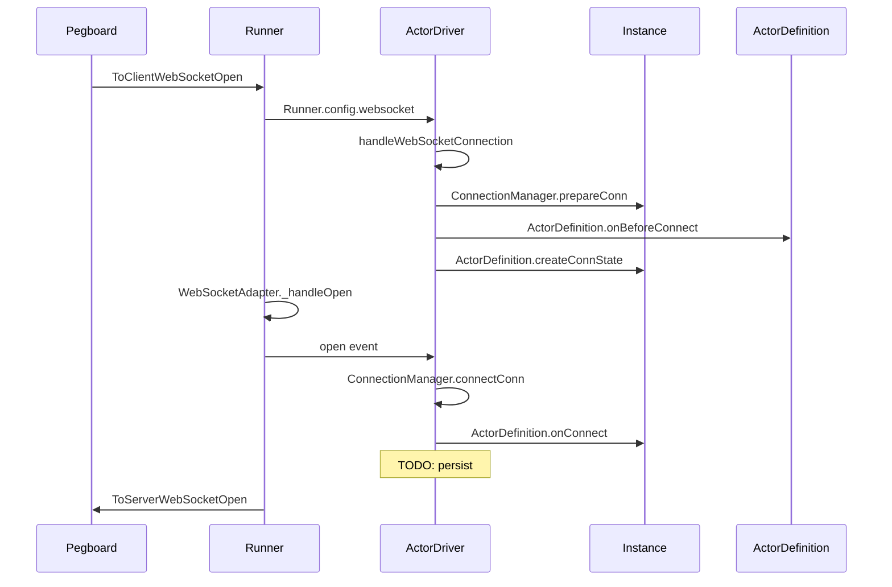
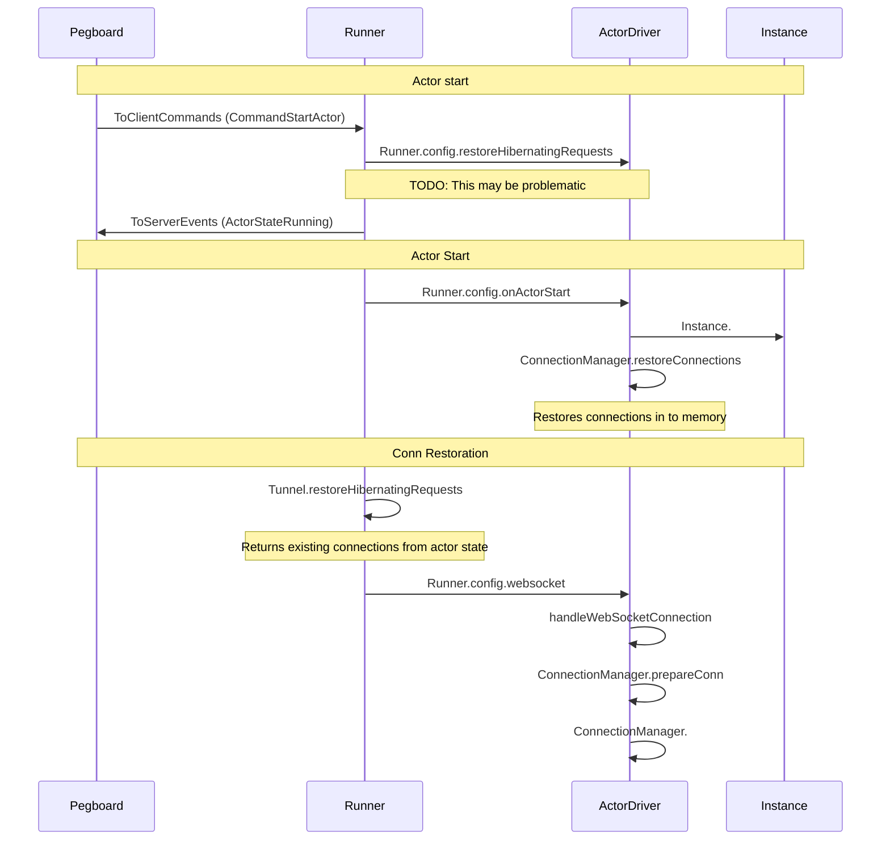
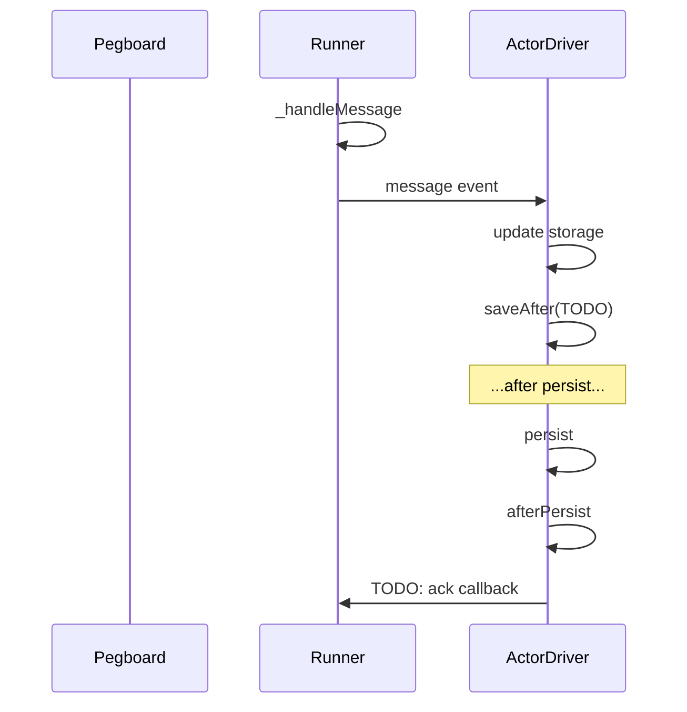

# Hibernatable Connections

## Lifecycle

### New Connection



### Restore Connection




TODO: Disconnecting stale conns
TODO: Disconnecting zombie conns

### Persisting Message Index



### Close Connection

```
TODO
```

