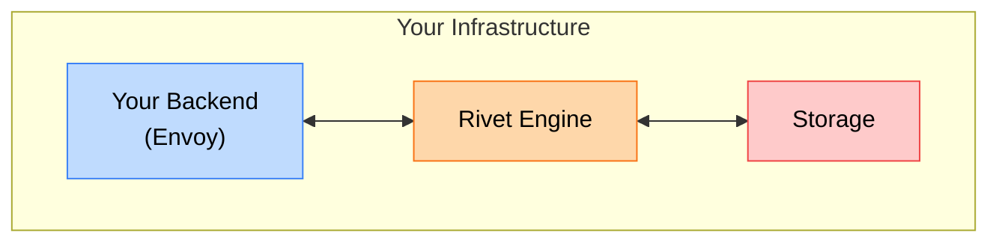
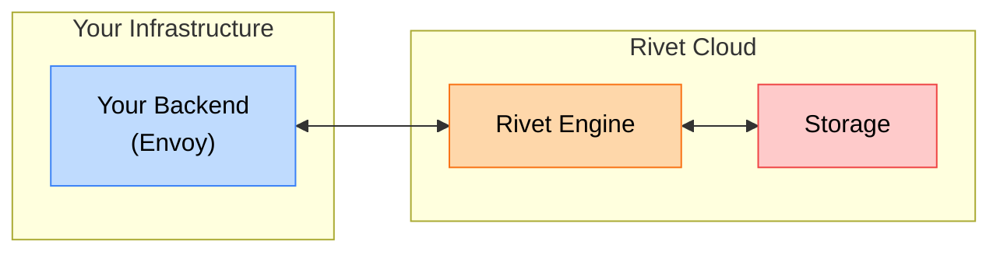
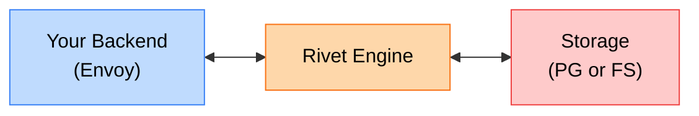

{/* Mermaid measures each node label's foreignObject width using its default
sans font, but the docs body font (JetBrains Mono) is wider, so the rendered
label overflows the measured foreignObject and its `overflow: hidden` clips the
text. Forcing the diagram labels back to a normal sans stack makes the rendered
width match Mermaid's measurement so every label fits inside its node box. The
overflow/centering rules are a belt-and-suspenders fallback so any residual
width difference spills symmetrically inside the already-wide node rect instead
of clipping on the right. */}

## Self-Host vs BYOC

**Self-Host**

**BYOC with Rivet Cloud**

Rivet supports both BYOC (Bring Your Own Cloud) and self-hosting to fit your deployment needs.

| | Self-Hosting | BYOC with Rivet Cloud |
|---|---|---|
| **You Manage** | Full stack (your backend, engine, Rivet Engine, database) | Only your backend |
| **Complexity** | Higher (full stack deployment) | Lower (connect and deploy) |
| **Cost** | Higher operational overhead | Usually lower usage-based cost |
| **Supports Serverless** | Requires extra infrastructure | Yes |
| **Air-Gapped Deployments** | Yes | No |
| **Best For** | Air-gapped environments, strict compliance, custom security policies | All other production deployments |
| **Support** | [Contact sales](/sales) or community | Community, Slack, and email (varies by plan) |
| **Documentation** | Continue below | [See connect guides](/docs/deploy) |

## Architecture

Rivet has 3 core components:

- **Your Backend**: Your application server that handles user requests and includes an envoy component that executes actor code
- **Rivet Engine**: Main orchestration service that manages actor lifecycle, routes messages, and provides APIs
- **Storage**: Persistence layer for actor state and messaging infrastructure for real-time communication

## Storage Backends

Rivet supports multiple storage backends:

- **File System**: Recommended for smaller single-node deployments today
- **PostgreSQL**: Recommended for multi-node deployments today, but still experimental
- **FoundationDB**: Best scalability and performance for production-ready deployments ([requires enterprise](/sales))

## Deployment Platforms

Deploy Rivet on your preferred platform:

- [Docker Container](/docs/self-hosting/docker-container)
- [Docker Compose](/docs/self-hosting/docker-compose)
- [Railway](/docs/self-hosting/railway)
- [Render](/docs/self-hosting/render)
- [Kubernetes](/docs/self-hosting/kubernetes)
- AWS Fargate
- Google Cloud Run
- Hetzner
- VM & Bare Metal

_Self-hosting guides coming soon._

## Next Steps

- [Install Rivet Engine](/docs/self-hosting/install)
- [Connect your backend](/docs/general/endpoints)
- [Configure your deployment](/docs/self-hosting/configuration)
- [Multi-region setup](/docs/self-hosting/multi-region)
