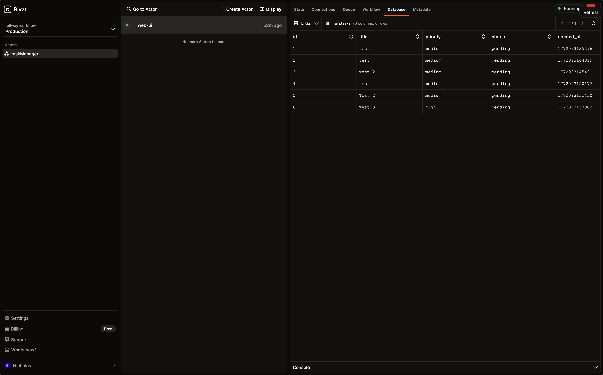

Today we're releasing **[SQLite for Rivet Actors](/docs/actors/sqlite)**: embedded, per-actor SQLite databases that run at the edge.

- **Massive multi-tenancy**: one database per actor, millions of isolated databases for affordable multi-tenancy
- **Scales to zero**: idle databases cost nothing
- **Zero-latency reads**: compute and storage co-located, no network hops
- **Runs at the edge**: databases live near your users, not in a distant region
- **First-class Drizzle ORM support**: typed schema, typed queries, generated migrations
- **Realtime React**: stream database changes to your frontend with `useActor`
- **The only open-source SQLite multi-tenant platform**: managed SQLite with millions of databases per project, Apache 2.0, deploy anywhere

## Show Me The Code

Define `db` on your actor and you get a full SQLite database scoped to that actor instance. No connection strings, no provisioning, no config.

<CodeGroup>
```ts Basic
import { actor, setup } from "rivetkit";
import { db } from "rivetkit/db";

const todoList = actor({
  // Each actor instance gets its own SQLite database
  db: db({
    // Create tables on first run
    onMigrate: async (db) => {
      await db.execute(`
        CREATE TABLE IF NOT EXISTS todos (
          id INTEGER PRIMARY KEY AUTOINCREMENT,
          title TEXT NOT NULL,
          completed INTEGER NOT NULL DEFAULT 0
        );
      `);
    },
  }),
  actions: {
    // Parameterized queries with ? placeholders
    addTodo: async (c, title: string) => {
      await c.db.execute("INSERT INTO todos (title) VALUES (?)", title);
    },
    toggleTodo: async (c, id: number) => {
      await c.db.execute(
        "UPDATE todos SET completed = NOT completed WHERE id = ?",
        id,
      );
    },
    // SELECT returns typed row objects
    getTodos: async (c) => {
      return (await c.db.execute(
        "SELECT id, title, completed FROM todos ORDER BY id DESC",
      )) as { id: number; title: string; completed: number }[];
    },
  },
});

export const registry = setup({ use: { todoList } });
```

```ts Drizzle
import { actor, setup } from "rivetkit";
import { db } from "rivetkit/db/drizzle";
import { integer, sqliteTable, text } from "rivetkit/db/drizzle";
import { eq } from "drizzle-orm";
// Auto-generated by `drizzle-kit generate`
import migrations from "./drizzle/migrations.js";

// Define typed schema
const todos = sqliteTable("todos", {
  id: integer("id").primaryKey({ autoIncrement: true }),
  title: text("title").notNull(),
  completed: integer("completed").notNull().default(0),
});

const schema = { todos };

const todoList = actor({
  // Drizzle handles migrations automatically from generated files
  db: db({ schema, migrations }),
  actions: {
    addTodo: async (c, title: string) => {
      // Typed insert with .returning()
      const rows = await c.db.insert(todos).values({ title }).returning();
      return rows[0];
    },
    toggleTodo: async (c, id: number) => {
      // Typed select with .where()
      const current = await c.db
        .select()
        .from(todos)
        .where(eq(todos.id, id));
      if (current.length > 0) {
        await c.db
          .update(todos)
          .set({ completed: current[0].completed ? 0 : 1 })
          .where(eq(todos.id, id));
      }
    },
    getTodos: async (c) => {
      // Typed results, no manual casting
      return await c.db.select().from(todos).orderBy(todos.id);
    },
  },
});

export const registry = setup({ use: { todoList } });
```

```ts Queues
import { actor, queue, setup } from "rivetkit";
import { db } from "rivetkit/db";

const todoList = actor({
  db: db({
    onMigrate: async (db) => {
      await db.execute(`
        CREATE TABLE IF NOT EXISTS todos (
          id INTEGER PRIMARY KEY AUTOINCREMENT,
          title TEXT NOT NULL,
          completed INTEGER NOT NULL DEFAULT 0
        );
      `);
    },
  }),
  // Typed queues for ordered, durable writes
  queues: {
    addTodo: queue<{ title: string }>(),
    toggleTodo: queue<{ id: number }>(),
  },
  // Process queue messages sequentially
  run: async (c) => {
    for await (const message of c.queue.iter()) {
      if (message.name === "addTodo") {
        await c.db.execute(
          "INSERT INTO todos (title) VALUES (?)",
          message.body.title,
        );
      } else if (message.name === "toggleTodo") {
        await c.db.execute(
          "UPDATE todos SET completed = NOT completed WHERE id = ?",
          message.body.id,
        );
      }
    }
  },
  // Keep actions read-only
  actions: {
    getTodos: async (c) => {
      return (await c.db.execute(
        "SELECT id, title, completed FROM todos ORDER BY id DESC",
      )) as { id: number; title: string; completed: number }[];
    },
  },
});

export const registry = setup({ use: { todoList } });
```

```ts Transactions
import { actor, setup } from "rivetkit";
import { db } from "rivetkit/db";

const ledger = actor({
  db: db({
    onMigrate: async (db) => {
      await db.execute(`
        CREATE TABLE IF NOT EXISTS accounts (
          id TEXT PRIMARY KEY,
          balance INTEGER NOT NULL DEFAULT 0
        );
      `);
      await db.execute(`
        CREATE TABLE IF NOT EXISTS transfers (
          id INTEGER PRIMARY KEY AUTOINCREMENT,
          from_id TEXT NOT NULL,
          to_id TEXT NOT NULL,
          amount INTEGER NOT NULL
        );
      `);
    },
  }),
  actions: {
    // Atomic transfer: debit, credit, and log succeed or fail together
    transfer: async (c, fromId: string, toId: string, amount: number) => {
      await c.db.execute("BEGIN");
      try {
        // Debit sender
        await c.db.execute(
          "UPDATE accounts SET balance = balance - ? WHERE id = ?",
          amount,
          fromId,
        );
        // Credit receiver
        await c.db.execute(
          "UPDATE accounts SET balance = balance + ? WHERE id = ?",
          amount,
          toId,
        );
        // Log the transfer
        await c.db.execute(
          "INSERT INTO transfers (from_id, to_id, amount) VALUES (?, ?, ?)",
          fromId,
          toId,
          amount,
        );
        await c.db.execute("COMMIT");
      } catch (error) {
        // Roll back all changes on failure
        await c.db.execute("ROLLBACK");
        throw error;
      }
    },
    getBalance: async (c, accountId: string) => {
      const rows = (await c.db.execute(
        "SELECT balance FROM accounts WHERE id = ?",
        accountId,
      )) as { balance: number }[];
      return rows[0]?.balance ?? 0;
    },
  },
});

export const registry = setup({ use: { ledger } });
```
</CodeGroup>

## Realtime React Integration

Combine SQLite with actor events and `useActor` to build realtime apps. Writes persist to SQLite and broadcast to every connected client instantly.

<CodeGroup workspace>
```ts actors.ts
import { actor, event, setup } from "rivetkit";
import { db } from "rivetkit/db";

interface Todo {
  id: number;
  title: string;
  completed: number;
}

export const todoList = actor({
  db: db({
    onMigrate: async (db) => {
      await db.execute(`
        CREATE TABLE IF NOT EXISTS todos (
          id INTEGER PRIMARY KEY AUTOINCREMENT,
          title TEXT NOT NULL,
          completed INTEGER NOT NULL DEFAULT 0
        );
      `);
    },
  }),
  // Typed events that clients can subscribe to
  events: {
    todosUpdated: event<Todo[]>(),
  },
  actions: {
    addTodo: async (c, title: string) => {
      // Write to SQLite
      await c.db.execute("INSERT INTO todos (title) VALUES (?)", title);
      // Broadcast updated list to all connected clients
      const todos = (await c.db.execute(
        "SELECT id, title, completed FROM todos ORDER BY id DESC",
      )) as Todo[];
      c.broadcast("todosUpdated", todos);
    },
    toggleTodo: async (c, id: number) => {
      await c.db.execute(
        "UPDATE todos SET completed = NOT completed WHERE id = ?",
        id,
      );
      const todos = (await c.db.execute(
        "SELECT id, title, completed FROM todos ORDER BY id DESC",
      )) as Todo[];
      c.broadcast("todosUpdated", todos);
    },
    getTodos: async (c) => {
      return (await c.db.execute(
        "SELECT id, title, completed FROM todos ORDER BY id DESC",
      )) as Todo[];
    },
  },
});

export const registry = setup({ use: { todoList } });
```

```tsx App.tsx
import { useState, useEffect } from "react";
import { createRivetKit } from "@rivetkit/react";
import type { registry } from "./actors";

const { useActor } = createRivetKit<typeof registry>();

function TodoApp() {
  // Connect to the actor over WebSockets
  const { connection, connStatus, useEvent } = useActor({
    name: "todoList",
    key: ["my-list"],
  });
  const [todos, setTodos] = useState<
    { id: number; title: string; completed: number }[]
  >([]);
  const [input, setInput] = useState("");

  // Load initial data
  useEffect(() => {
    if (!connection) return;
    connection.getTodos().then(setTodos);
  }, [connection]);

  // Live updates from the actor
  useEvent("todosUpdated", setTodos);

  if (connStatus !== "connected") return <div>Connecting...</div>;

  return (
    <div>
      <form
        onSubmit={(e) => {
          e.preventDefault();
          connection!.addTodo(input);
          setInput("");
        }}
      >
        <input value={input} onChange={(e) => setInput(e.target.value)} />
        <button type="submit">Add</button>
      </form>
      <ul>
        {todos.map((todo) => (
          <li
            key={todo.id}
            onClick={() => connection!.toggleTodo(todo.id)}
            style={{
              textDecoration: todo.completed ? "line-through" : "none",
              cursor: "pointer",
            }}
          >
            {todo.title}
          </li>
        ))}
      </ul>
    </div>
  );
}
```
</CodeGroup>

## Built-in Database Explorer

Browse and query your actor databases directly from the Rivet Hub. Select any actor instance to view its tables, run queries, and inspect data in realtime.



## Massive Multi-Tenancy

Every actor instance gets **its own SQLite database**. Spin up millions of isolated databases, one per user, one per workspace, one per document. No connection pools, no row-level security, no per-tenant configuration.

## Zero-Latency Reads

Compute and storage live on the same machine. Queries read from **local memory**, not over the network to an external database. No connection overhead, no round trips.

## Scale to Zero

Actors **hibernate when idle**. A database with no traffic costs nothing. When a request arrives, the actor wakes up with its full SQLite database intact. You only pay for what you use.

## At the Edge, Realtime by Default

Rivet Actors run **at the edge, close to your users**. Combined with actor events and WebSockets, you get a realtime data layer with no additional infrastructure. Write to SQLite, broadcast the change, and every connected client sees it instantly.

## Open Source, Deploy Anywhere

Rivet is **the only multi-tenant SQLite platform that's open-source**. Apache 2.0. Deploy on Cloudflare Workers, Vercel, Railway, or your own infrastructure. No vendor lock-in.

Plus everything else that comes with [Rivet Actors](/docs/actors): scale to millions of instances, TypeScript-native, WebSocket events, queues, state, and workflows.

## Get Started

SQLite is available today in RivetKit.

```bash
npm install rivetkit
```

```ts
import { db } from "rivetkit/db";
```

- [SQLite documentation](/docs/actors/sqlite)
- [SQLite + Drizzle documentation](/docs/actors/sqlite-drizzle)
- [GitHub](https://github.com/rivet-dev/rivet)
- [Discord](https://rivet.dev/discord)
