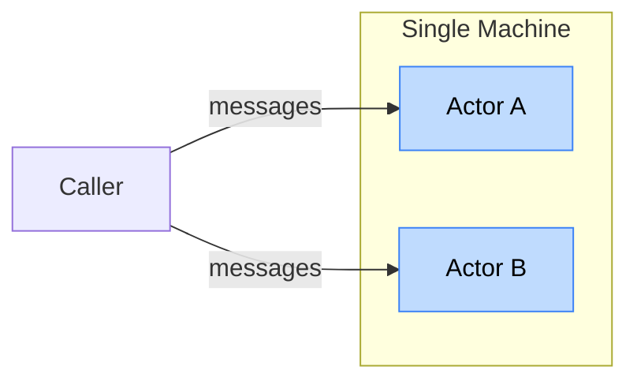
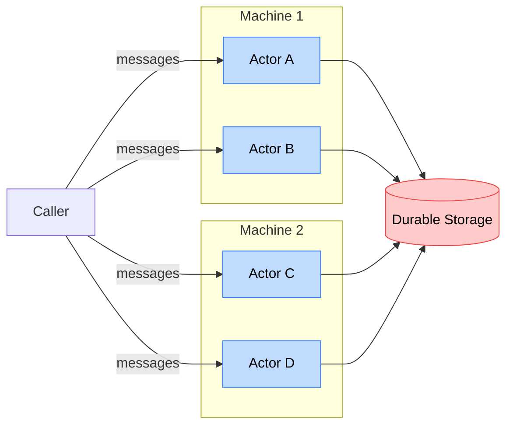

Today we're releasing the **[RivetKit Rust SDK](/docs/actors/quickstart/rust)** (beta): a native, typed Rust SDK for [Rivet Actors](/docs/actors).

## Same Fearless Concurrency, a Lot More Machines

{/* Mermaid measures each node label's foreignObject width using its default
sans font, but the docs body font (JetBrains Mono) is wider, so the rendered
label overflows the measured foreignObject and its `overflow: hidden` clips the
text. Forcing the diagram labels back to a normal sans stack makes the rendered
width match Mermaid's measurement so every label fits inside its node box. The
overflow/centering rules are a belt-and-suspenders fallback so any residual
width difference spills symmetrically inside the already-wide node rect instead
of clipping on the right. */}
<style>{`
  pre.mermaid .nodeLabel,
  pre.mermaid .edgeLabel,
  pre.mermaid .cluster-label,
  pre.mermaid foreignObject *,
  pre.mermaid text {
    font-family: ui-sans-serif, system-ui, -apple-system, "Segoe UI", Roboto, sans-serif !important;
  }
  pre.mermaid foreignObject {
    overflow: visible;
  }
  pre.mermaid foreignObject > div,
  pre.mermaid .nodeLabel {
    width: max-content;
    max-width: none;
    margin: 0 auto;
  }
`}</style>

### Actors without Rivet

You can already write the actor pattern in plain async Rust: a Tokio task that owns state behind a channel is a lightweight actor. One owner, message passing, no locks.

```rust
// State lives in the task; reach it over a channel.
let (tx, mut rx) = mpsc::channel(32);
tokio::spawn(async move {
	let mut count = 0;
	while let Some(amount) = rx.recv().await {
		count += amount;
	}
});
```

It's **fearless concurrency**, but it **never leaves the process**. The handle works in-process only, and the in-memory state dies with the task.



### Actors with Rivet

A Rivet Actor keeps that exact shape but makes it **stateful and distributed** (the [virtual actor](https://learn.microsoft.com/en-us/dotnet/orleans/overview) pattern):

- **Stateful**: Like a long-lived task, it stays alive between calls and holds its state in memory instead of rebuilding it on every request.
- **Durable**: State is persisted and outlives the process instead of dying with the task.
- **Addressable**: You reach it by key from anywhere, not through an in-process handle.
- **Distributed**: The runtime spreads thousands across machines instead of pinning one.
- **Fault tolerant**: It restarts on failure with state preserved, instead of vanishing when the task or process dies.

That same architecture, distributed across machines by Rivet, looks like this:



See the [crash course](/docs/actors/crash-course) for an introduction to Actors.

## Show Me The Code

<Tabs>
<Tab title="Counter">

The smallest useful actor: typed actions, persisted state, and an event broadcast to every connected client.

```rust
use std::{future::Future, pin::Pin, sync::Arc};

use async_trait::async_trait;
use rivetkit::prelude::*;
use serde::{Deserialize, Serialize};

pub const ACTOR_NAME: &str = "counter";

pub struct Counter;

// Persisted state: serialized, validated, and restored on wake.
#[derive(Default, Serialize, Deserialize)]
pub struct CounterState {
	pub count: i64,
}

// A typed action with an explicit payload and `Output`.
#[derive(Debug, Serialize, Deserialize)]
pub struct Increment {
	pub amount: i64,
}

impl Action for Increment {
	type Output = i64;

	const NAME: &'static str = "increment";
}

#[derive(Debug, Serialize, Deserialize)]
pub struct GetCount;

impl Action for GetCount {
	type Output = i64;

	const NAME: &'static str = "getCount";
}

// A typed event broadcast to every connected client.
#[derive(Debug, Serialize, Deserialize)]
pub struct NewCount {
	pub count: i64,
}

impl Event for NewCount {
	const NAME: &'static str = "newCount";
}

#[async_trait]
impl Actor for Counter {
	type State = CounterState;
	type Input = ();
	type Actions = (Increment, GetCount);
	type Events = (NewCount,);
	type Queue = ();
	type ConnParams = ();
	type ConnState = ();
	type Action = action::Raw;

	async fn create_state(_ctx: &Ctx<Self>, _input: Self::Input) -> Result<Self::State> {
		Ok(CounterState::default())
	}

	async fn create(_ctx: &Ctx<Self>) -> Result<Self> {
		Ok(Self)
	}
}

impl Handles<Increment> for Counter {
	type Future = BoxFuture<i64>;

	fn handle(self: Arc<Self>, ctx: Ctx<Self>, action: Increment) -> Self::Future {
		Box::pin(async move {
			// In-memory read-modify-write; the change is persisted for you.
			let count = {
				let mut state = ctx.state_mut();
				state.count += action.amount;
				state.count
			};
			// Broadcast the new value to every connected client.
			ctx.emit(NewCount { count })?;
			Ok(count)
		})
	}
}

impl Handles<GetCount> for Counter {
	type Future = BoxFuture<i64>;

	fn handle(self: Arc<Self>, ctx: Ctx<Self>, _action: GetCount) -> Self::Future {
		Box::pin(async move { Ok(ctx.state().count) })
	}
}

pub fn registry() -> Registry {
	let mut registry = Registry::new();
	registry.register_actor::<Counter>(ACTOR_NAME);
	registry
}

type BoxFuture<T> = Pin<Box<dyn Future<Output = Result<T>> + Send>>;
```

</Tab>
<Tab title="Chat Room + SQLite">

The same shape, plus embedded SQLite for durable history and a plain struct field for ephemeral state. This is the [`chat-room-rust`](https://github.com/rivet-dev/rivet/tree/main/examples/chat-room-rust) example.

```rust
use std::time::{SystemTime, UNIX_EPOCH};
use std::{future::Future, pin::Pin, sync::Arc};

use async_trait::async_trait;
use rivetkit::prelude::*;
use rivetkit::{BindParam, ColumnValue};
use serde::{Deserialize, Serialize};

pub const ACTOR_NAME: &str = "chatRoom";

pub struct ChatRoom {
	started_at_ms: i64,
}

#[derive(Default, Serialize, Deserialize)]
pub struct ChatRoomState {
	pub sent_count: u64,
}

#[derive(Clone, Debug, PartialEq, Eq, Serialize, Deserialize)]
pub struct Message {
	pub sender: String,
	pub text: String,
	pub timestamp: i64,
}

#[derive(Debug, Serialize, Deserialize)]
pub struct SendMessage {
	pub sender: String,
	pub text: String,
}

impl Action for SendMessage {
	type Output = Message;

	const NAME: &'static str = "sendMessage";
}

#[derive(Debug, Serialize, Deserialize)]
pub struct GetHistory;

impl Action for GetHistory {
	type Output = Vec<Message>;

	const NAME: &'static str = "getHistory";
}

#[derive(Debug, Serialize, Deserialize)]
pub struct GetStats;

#[derive(Debug, PartialEq, Eq, Serialize, Deserialize)]
pub struct RoomStats {
	pub sent_count: u64,
	pub started_at_ms: i64,
}

impl Action for GetStats {
	type Output = RoomStats;

	const NAME: &'static str = "getStats";
}

#[derive(Debug, Serialize, Deserialize)]
pub struct NewMessage {
	pub message: Message,
}

impl Event for NewMessage {
	const NAME: &'static str = "newMessage";
}

#[async_trait]
impl Actor for ChatRoom {
	type State = ChatRoomState;
	type Input = ();
	type Actions = (SendMessage, GetHistory, GetStats);
	type Events = (NewMessage,);
	type Queue = ();
	type ConnParams = ();
	type ConnState = ();
	type Action = action::Raw;

	const HAS_DATABASE: bool = true;

	async fn create_state(_ctx: &Ctx<Self>, _input: Self::Input) -> Result<Self::State> {
		Ok(ChatRoomState::default())
	}

	async fn create(ctx: &Ctx<Self>) -> Result<Self> {
		ctx.sql()
			.execute(
				"CREATE TABLE IF NOT EXISTS messages (
					id INTEGER PRIMARY KEY AUTOINCREMENT,
					sender TEXT NOT NULL,
					text TEXT NOT NULL,
					timestamp INTEGER NOT NULL
				)",
				None,
			)
			.await?;
		Ok(Self {
			started_at_ms: now_ms(),
		})
	}
}

impl Handles<SendMessage> for ChatRoom {
	type Future = BoxFuture<Message>;

	fn handle(self: Arc<Self>, ctx: Ctx<Self>, action: SendMessage) -> Self::Future {
		Box::pin(async move {
			let message = send_message(&ctx, action.sender, action.text).await?;
			ctx.state_mut().sent_count += 1;
			ctx.emit(NewMessage {
				message: message.clone(),
			})?;
			Ok(message)
		})
	}
}

impl Handles<GetHistory> for ChatRoom {
	type Future = BoxFuture<Vec<Message>>;

	fn handle(self: Arc<Self>, ctx: Ctx<Self>, _action: GetHistory) -> Self::Future {
		Box::pin(async move { get_history(&ctx).await })
	}
}

impl Handles<GetStats> for ChatRoom {
	type Future = BoxFuture<RoomStats>;

	fn handle(self: Arc<Self>, ctx: Ctx<Self>, _action: GetStats) -> Self::Future {
		Box::pin(async move {
			Ok(RoomStats {
				sent_count: ctx.state().sent_count,
				started_at_ms: self.started_at_ms,
			})
		})
	}
}

pub fn registry() -> Registry {
	let mut registry = Registry::new();
	registry.register_actor::<ChatRoom>(ACTOR_NAME);
	registry
}

async fn send_message(ctx: &Ctx<ChatRoom>, sender: String, text: String) -> Result<Message> {
	let timestamp = now_ms();
	ctx.sql()
		.execute(
			"INSERT INTO messages (sender, text, timestamp) VALUES (?, ?, ?)",
			Some(vec![
				BindParam::Text(sender.clone()),
				BindParam::Text(text.clone()),
				BindParam::Integer(timestamp),
			]),
		)
		.await?;
	Ok(Message {
		sender,
		text,
		timestamp,
	})
}

async fn get_history(ctx: &Ctx<ChatRoom>) -> Result<Vec<Message>> {
	let result = ctx
		.sql()
		.query(
			"SELECT sender, text, timestamp FROM messages ORDER BY id ASC",
			None,
		)
		.await?;
	let mut messages = Vec::with_capacity(result.rows.len());
	for row in result.rows {
		messages.push(Message {
			sender: column_text(row.first())?,
			text: column_text(row.get(1))?,
			timestamp: column_int(row.get(2))?,
		});
	}
	Ok(messages)
}

fn column_text(value: Option<&ColumnValue>) -> Result<String> {
	match value {
		Some(ColumnValue::Text(text)) => Ok(text.clone()),
		other => Err(anyhow!("expected text column, got {other:?}")),
	}
}

fn column_int(value: Option<&ColumnValue>) -> Result<i64> {
	match value {
		Some(ColumnValue::Integer(int)) => Ok(*int),
		other => Err(anyhow!("expected integer column, got {other:?}")),
	}
}

fn now_ms() -> i64 {
	SystemTime::now()
		.duration_since(UNIX_EPOCH)
		.map(|d| d.as_millis() as i64)
		.unwrap_or_default()
}

type BoxFuture<T> = Pin<Box<dyn Future<Output = Result<T>> + Send>>;
```

</Tab>
</Tabs>

## The Full Actor Toolbox

### Features of Rivet Actors

Every actor includes:

- **Networking** ([docs](/docs/actors/fetch-and-websocket-handler)): Each actor is its own HTTP server, answering plain HTTP or raw WebSocket connections directly through the engine, with no separate gateway.
- **SQLite** ([docs](/docs/actors/sqlite)): Each actor gets its own embedded, co-located database.
- **Actions** ([docs](/docs/actors/actions)): A typed RPC surface, checked from caller to handler.
- **Events** ([docs](/docs/actors/events)): Broadcast to connected clients over WebSockets, with no external pub/sub.
- **Queues** ([docs](/docs/actors/queues)): Durable background work pushed from any handler.
- **Actor-to-actor calls** ([docs](/docs/actors/communicating-between-actors)): Address and call another actor by key, fully typed.
- **Scheduling and alarms** ([docs](/docs/actors/schedule)): Run an action later, or wake a sleeping actor at a timestamp.
- **Lifecycle** ([docs](/docs/actors/lifecycle)): Idle actors hibernate and wake on demand, with hooks to stay up around critical work.
- **Global distribution** ([docs](/docs/actors/scaling)): Optionally spread actors across regions so each one runs close to its users.
- **Observability** ([docs](/docs/actors/debugging)): A live dashboard to inspect running actors, their state, and events, with no instrumentation in your code.

### An SDK Crafted with Care

- **Full-stack type safety**: Action payloads and return types are checked at compile time, all the way from the caller to the handler.
- **Serde-native**: State, actions, and events are ordinary `Serialize` / `Deserialize` types. No bespoke schema layer to learn.
- **No DSL or codegen**: Actors are plain Rust traits, structs, and `impl` blocks. No build step and no actor macros.
- **Observable out of the box**: Fully wired for OpenTelemetry and debuggable with [`tokio-console`](https://github.com/tokio-rs/console).

## Polyglot Apps

RivetKit isn't one isolated runtime per language. Every SDK talks to the same engine and resolves actors by name, so languages mix freely on both sides of a call.

- **Mix actors across languages**: Rust and TypeScript actors run side by side in one app and call each other's actions, neither side knowing the other's language. Keep your product surface in TypeScript and move CPU-bound actors to Rust.
- **Mix clients across languages**: The same actor answers a Rust client, a [TypeScript client](/docs/clients/javascript), [React hooks](/docs/clients/react), or plain HTTP, because names resolve at runtime.
- **One core under the hood**: Every SDK is a thin binding over `rivetkit-core`, so each language gets the same semantics. The Rust SDK calls it directly with no bridge and zero FFI overhead.

## Deploying

- **[Rivet Cloud](https://dashboard.rivet.dev/), BYOC, or fully [on-prem](/docs/self-hosting)**: Run it fully managed, bring your own cloud (**Railway, Render, Lambda, and more**), or self-host the whole stack.
- **Local dev with no compromises**: The full Rivet featureset runs on your machine, with no SaaS dependencies.
- **Containers or serverless**: Serverless scales to zero between bursts; containers give you flexible deployment options.

See the [deployment guides](/docs/deploy) for the full platform list.

## Get Started

```bash
cargo add rivetkit
```

- [Rust SDK quickstart](/docs/actors/quickstart/rust)
- Example projects: [`hello-world-rust`](https://github.com/rivet-dev/rivet/tree/main/examples/hello-world-rust) and [`chat-room-rust`](https://github.com/rivet-dev/rivet/tree/main/examples/chat-room-rust)
- [GitHub](https://github.com/rivet-dev/rivet)
- [Discord](https://rivet.dev/discord)
